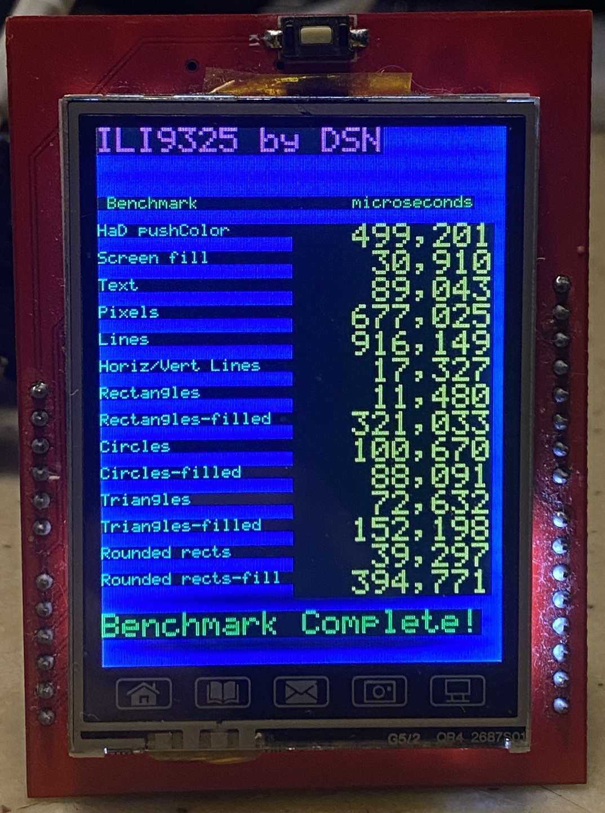
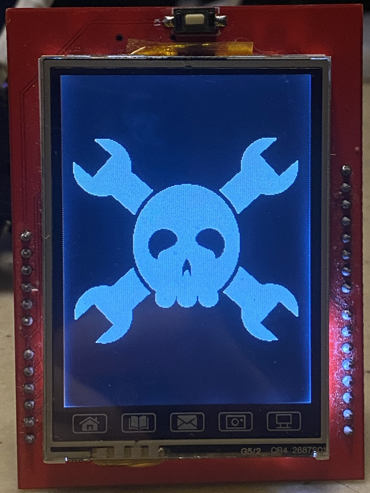
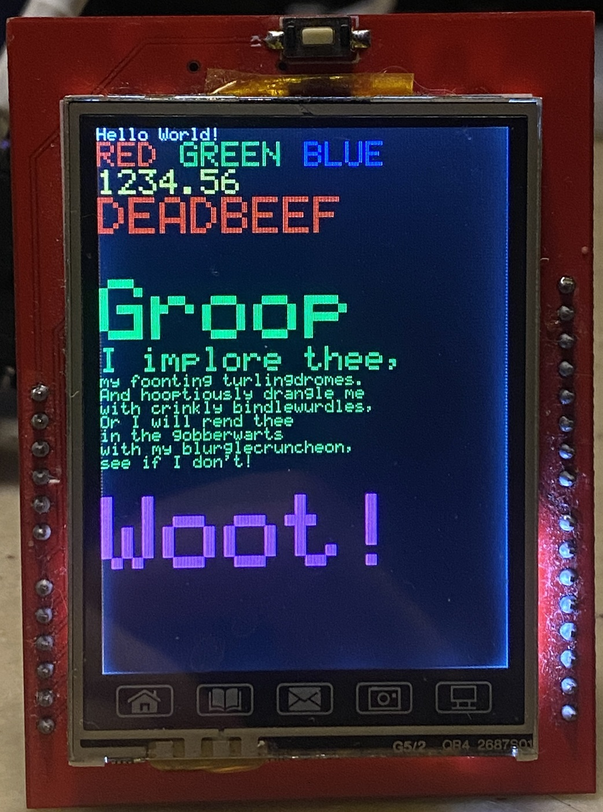
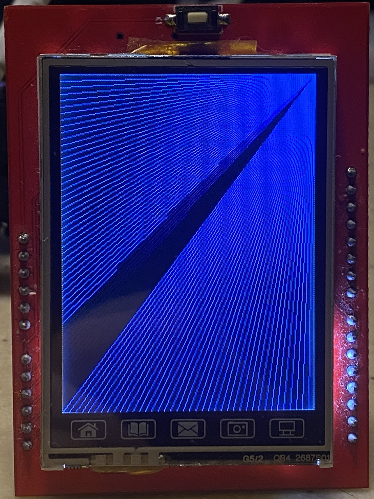
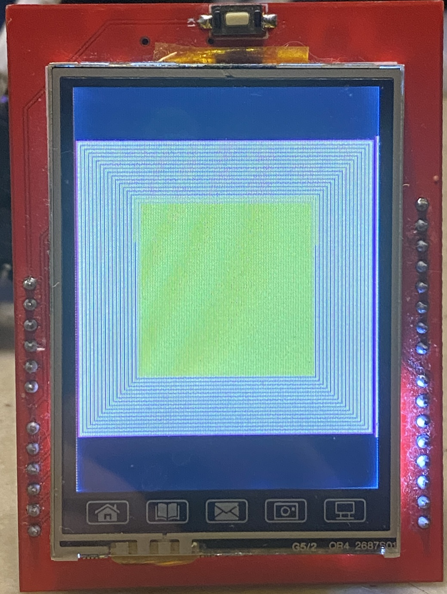

# ili9325 esp32 arduino library (aka MCU Friend 2.4 Arduino shield)

## ESP32 arduino based MCUFriend ILI9325 driver library

I am working on, for a now only usable with esp32 on arduino
As soon as posibble I share more detail
Touch panel not supported in this time.

Youtube tutorial video : 

Pin Configuration

TFT_D0 ----------- 22
 
TFT_D1------------ 18
 
TFT_D2 ----------- 26
 
TFT_D3 ----------- 25

TFT_D4 ----------- 17

TFT_D5 ----------- 16

TFT_D6 ----------- 27

TFT_D7 ----------- 5

TFT_RS------------ 19

TFT_WR ----------- 4

TFT_CS ----------- 21

TFT_RST ---------- 14

TFT_RD ----------- 2

GND -------------- GND

3.3V ------------- 3.3V

Don't use 5V pin

